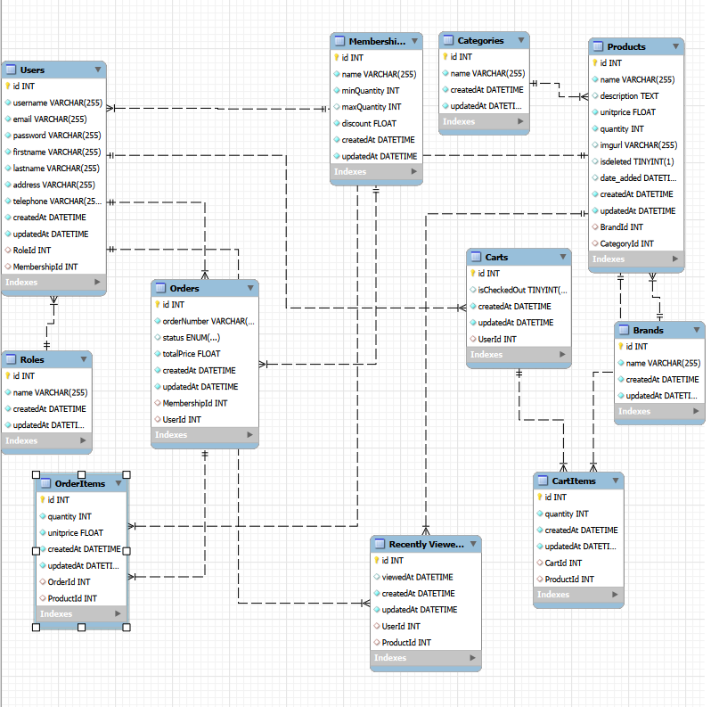
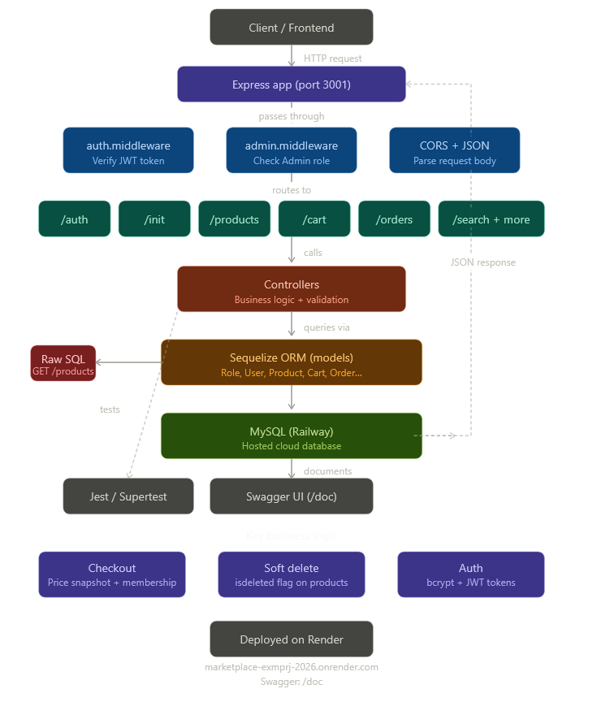

# Noroff EP Marketplace — Backend API

## Description
REST API for the Noroff EP e-commerce exam project. Built with Node.js, Express, Sequelize and MySQL.

## Tech Stack
- Node.js v22
- Express v5
- Sequelize v6
- MySQL (hosted on Railway)
- JWT Authentication
- Render.com (Backend hosting)
- Swagger UI at `/doc`

## Getting Started

### Floder Structure
```
├── 📁 BackendExm
│   ├── 📁 config
│   │   └── 📄 database.js
│   ├── 📁 controllers
│   │   ├── 📄 auth.controller.js
│   │   ├── 📄 brand.controller.js
│   │   ├── 📄 cart.controller.js
│   │   ├── 📄 category.controller.js
│   │   ├── 📄 init.controller.js
│   │   ├── 📄 membership.controller.js
│   │   ├── 📄 order.controller.js
│   │   ├── 📄 product.controller.js
│   │   ├── 📄 recentlyviewed.controller.js
│   │   ├── 📄 search.controller.js
│   │   └── 📄 user.controller.js
│   ├── 📁 middleware
│   │   ├── 📄 admin.middleware.js
│   │   └── 📄 auth.middleware.js
│   ├── 📁 models
│   │   ├── 📄 Brand.js
│   │   ├── 📄 Cart.js
│   │   ├── 📄 CartItem.js
│   │   ├── 📄 Category.js
│   │   ├── 📄 Membership.js
│   │   ├── 📄 Order.js
│   │   ├── 📄 OrderItem.js
│   │   ├── 📄 Product.js
│   │   ├── 📄 RecentlyViewed.js
│   │   ├── 📄 Role.js
│   │   ├── 📄 User.js
│   │   └── 📄 index.js
│   ├── 📁 public
│   │   └── 📁 stylesheets
│   │       └── 🎨 style.css
│   ├── 📁 recources
│   │   └── 🖼️ EER_Diagram-exmPRJ.png
│   ├── 📁 routes
│   │   ├── 📄 auth.routes.js
│   │   ├── 📄 brand.routes.js
│   │   ├── 📄 cart.routes.js
│   │   ├── 📄 category.routes.js
│   │   ├── 📄 index.js
│   │   ├── 📄 init.routes.js
│   │   ├── 📄 membership.routes.js
│   │   ├── 📄 order.routes.js
│   │   ├── 📄 product.routes.js
│   │   ├── 📄 recentlyviewed.routes.js
│   │   ├── 📄 search.routes.js
│   │   ├── 📄 user.routes.js
│   │   └── 📄 users.js
│   ├── 📁 swagger
│   │   └── 📄 swagger.js
│   ├── 📁 tests
│   │   └── 📄 api.test.js
│   ├── 📁 views
│   │   ├── 📄 error.ejs
│   │   └── 📄 index.ejs
│   ├── ⚙️ .gitignore
│   ├── 📄 app.js
│   ├── ⚙️ package-lock.json
│   └── ⚙️ package.json
└── 📝 readme.md
```
*Generated by FileTree Pro Extension*

### Prerequisites
- Node.js v22+
- MySQL database (local or Railway)

### Installation
```pwsh/ bash
git clone https://github.com/NoroffMax12/Marketplace-ExmPrj_2026.git
cd Marketplace-ExmPrj_2026/BackendExm

npm install
```

### Environment Variables
``` Create a `.env` file in the `BackendExm/` folder:
```
PORT=3001
DB_HOST=your_db_host
DB_PORT=your_db_port
DB_USER=your_db_user
DB_PASSWORD=your_db_password
DB_NAME=your_db_name
JWT_SECRET=your_jwt_secret

```

### Run the application
```pwsh/ bash
# Development
npm run dev

# Production
npm start
```

### Initialize the database
POST http://localhost:3001/init

This endpoint seeds the database with roles, admin user, memberships and products from the Noroff API. Only needs to be called once.

### Run tests
```pwsh/ bash
npm test
```

## API Documentation
Swagger UI is available at:
- Local: `http://localhost:3001/doc`
- Production: `https://marketplace-exmprj-2026.onrender.com/doc`

## Default Admin Credentials
- Email: admin@noroff.no
- Password: P@ssword2023


## Database tables & associations

##


##

