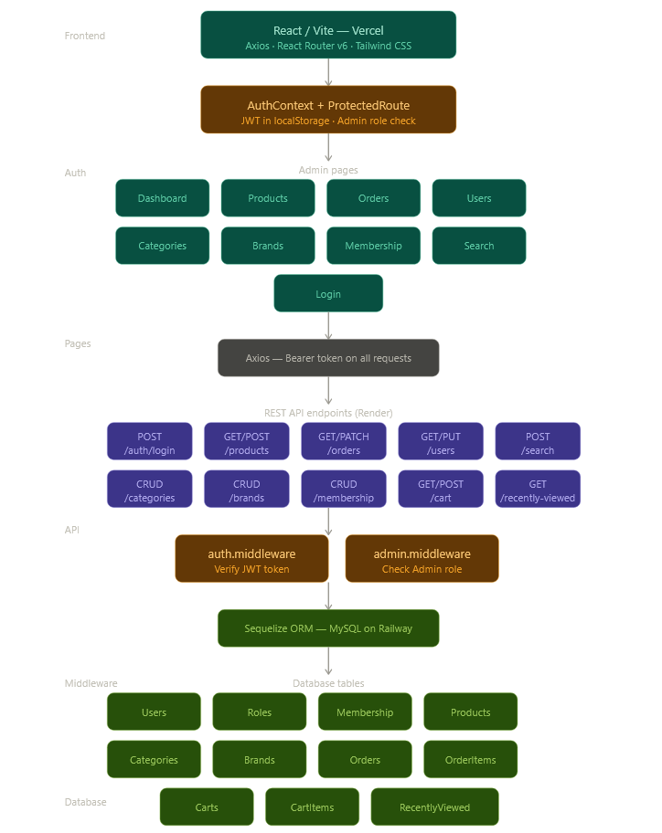

# EPAdmin — Frontend Marketplace Admin Panel


Admin dashboard for the Noroff EP Marketplace.
Built with React + Vite, deployed on Vercel.
 
**Live:** https://marketplace-exm-26.vercel.app
**Backend:** https://marketplace-exmprj-2026.onrender.com
**Swagger:** https://marketplace-exmprj-2026.onrender.com/doc
 
---
 
## Tech Stack
 
| Technology | Purpose |
|---|---|
| React 18 | UI framework |
| Vite 5 | Build tool & dev server |
| React Router v6 | Client-side routing |
| Axios | HTTP requests to backend API |
| Tailwind CSS v3 | Utility-first styling |
| Lucide React | Icon library |
| Recharts | Dashboard charts |
 
---
 
## Getting Started
 
### Installation
```bash
git clone https://github.com/NoroffMax12/Marketplace-ExmPrj_2026.git
cd Marketplace-ExmPrj_2026/FrontendExm
npm install
```
 
### Environment
Create a `.env` file in `FrontendExm/`:
```
VITE_API_URL=http://localhost:3001
```
 
### Run
```bash
npm run dev       # Development → http://localhost:5173
npm run build     # Production build
npm run preview   # Preview production build locally
```
 
---
 
## Admin Credentials (for testing)
```
Email:    admin@noroff.no
Password: P@ssword2023
```
 
---
 
## Project Structure

**Root Path:** `c:\BED_Noroff\PRJs\Mrktplace_Examprj_2026_MG\FrontendExm`
```
├── 📁 IMGs
├── 📁 public
│   ├── 🖼️ favicon.svg
│   └── 🖼️ icons.svg
├── 📁 src
│   ├── 📁 api
│   │   ├── 📄 auth.api.js
│   │   ├── 📄 axiosInstance.js
│   │   ├── 📄 brands.api.js
│   │   ├── 📄 categories.api.js
│   │   ├── 📄 membership.api.js
│   │   ├── 📄 orders.api.js
│   │   ├── 📄 products.api.js
│   │   ├── 📄 search.api.js
│   │   └── 📄 users.api.js
│   ├── 📁 components
│   │   ├── 📄 Badge.jsx
│   │   ├── 📄 Layout.jsx
│   │   ├── 📄 Modal.jsx
│   │   ├── 📄 ProtectedRoute.jsx
│   │   ├── 📄 Sidebar.jsx
│   │   └── 📄 StatCard.jsx
│   ├── 📁 context
│   │   ├── 📄 AuthContext.jsx
│   │   └── 📄 ToastContext.jsx
│   ├── 📁 pages
│   │   ├── 📄 Brands.jsx
│   │   ├── 📄 Categories.jsx
│   │   ├── 📄 Dashboard.jsx
│   │   ├── 📄 Login.jsx
│   │   ├── 📄 Membership.jsx
│   │   ├── 📄 Orders.jsx
│   │   ├── 📄 Products.jsx
│   │   ├── 📄 Search.jsx
│   │   └── 📄 Users.jsx
│   ├── 📄 App.jsx
│   ├── 🎨 index.css
│   └── 📄 main.jsx
├── ⚙️ .gitignore
├── 📝 README.md
├── 📄 eslint.config.js
├── 🌐 index.html
├── ⚙️ package-lock.json
├── ⚙️ package.json
├── 📄 postcss.config.js
├── 📄 tailwind.config.js
├── ⚙️ vercel.json
└── 📄 vite.config.js
```
---
*Generated by FileTree Pro Extension*

---
 
## Routes
 
| Path | Page | Access |
|---|---|---|
| `/login` | Login | Public |
| `/` | Dashboard | Admin only |
| `/products` | Products | Admin only |
| `/categories` | Categories | Admin only |
| `/brands` | Brands | Admin only |
| `/orders` | Orders | Admin only |
| `/users` | Users | Admin only |
| `/membership` | Membership | Admin only |
| `/search` | Search | Admin only |
 
---
 
## Key Notes
 
- `Products.date_added` — date field from backend, not `createdAt`
- `Orders.User.username` — nested object in backend response
- `Orders.Membership.name` — nested object in backend response
- `Orders.totalPrice` — not `total`
- `Users.RoleId` — `1 = Admin`, `2 = User` (sent as integer on PUT)
- `Membership.minQuantity` / `maxQuantity` — not `minPurchases`
---
 
## Deployment (Vercel)
 
1. Push to GitHub
2. Import repo in Vercel — set Root Directory to `FrontendExm`
3. Deploy — `vercel.json` handles SPA routing automatically

## Arcitecture

##

